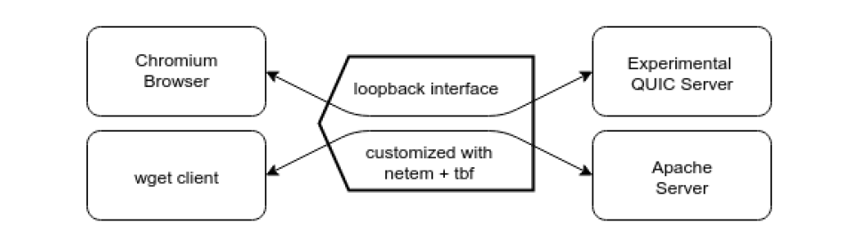
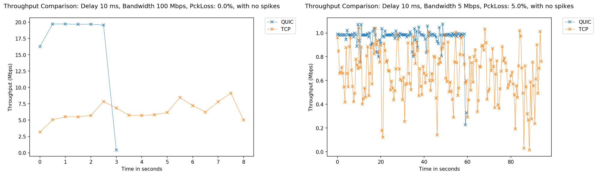
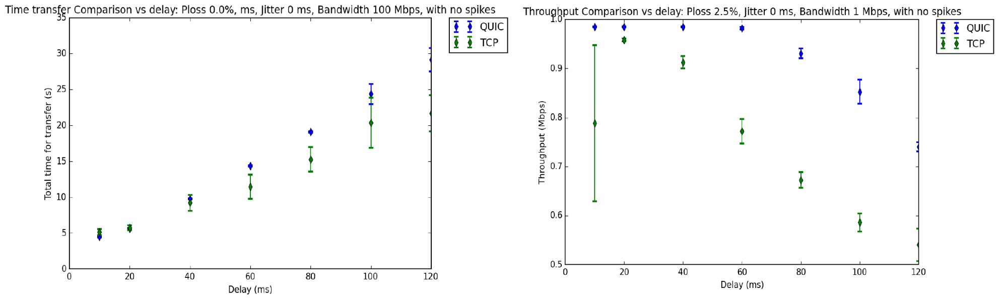
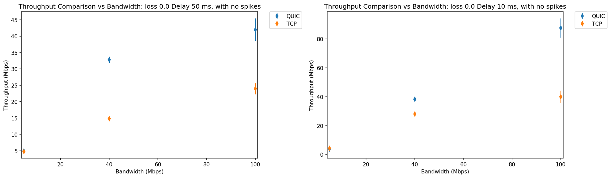
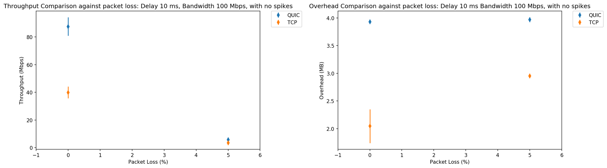
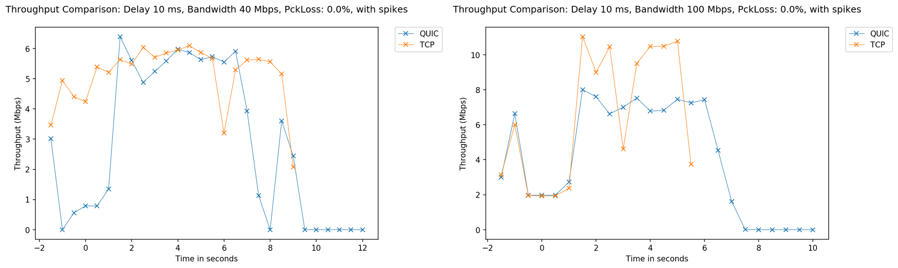
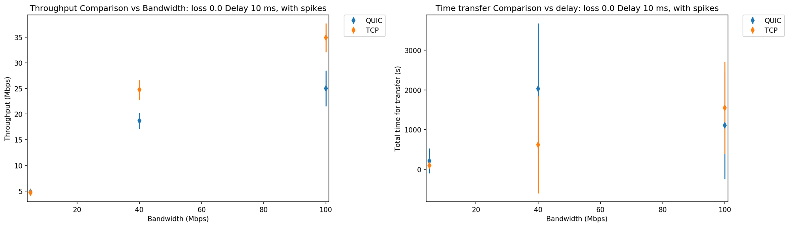

# QUIC vs TCP

A Survey and Benchmark of QUIC. 

## Introduction

### What is QUIC

### Key features
Key features of QUIC over existing TCP+TLS+HTTP2 include 
* Dramatically reduced connection establishment time
* Improved congestion control
* Multiplexing without head of line blocking
* Forward error correction
* Connection migration

### Goals

Analyze performance of TCP and QUIC in terms of:

* Total transfer time
* Average Bandwidth used
* Overhead in bytes

## Methods

### Experimental Setup

#### Overview

A 33.6 MB testfile `index.html` will generate in `/var/www/html/` and we will get it from *quic server* and *apache2 server* with *quic client* and *wget*. The protocal two way used is **QUIC** and **TCP**. And we will run the experiments under difference network enviroments.

For practical, we will use simulate enviroment in **local**. We use *tc netem* and *tbf* to config local loopback interface.



#### Experimental Platform

* Hardware
  | Hardware  |                                          |
  | --------- | ---------------------------------------- |
  | Memory    | 16GB                                     |
  | Processor | Intel® Xeon(R) CPU E3-1230 v5 @ 3.40GHz × 8 |
  | Disks     | SAMSUNG 850 EVO                          |
* Software
  | Software |                         |
  | -------- | ----------------------- |
  | OS       | Ubuntu16.04             |
  | OS-type  | 64 bit                  |
  | Kernel   | Linux 4.4.0-104-generic |
  | GCC      | GCC 5.4                 |
  | Python   | Python 2.7.12           |

#### Compile Chromium

Because of the quic protocal is embedded in Chromium, so we must build our *quic_server* and *quic_client* from the source of Chromium.

1. clone the source of chromuim
2. building for the first time, install dependencies
  ```shell
  ./src/build/install-build-deps.sh
  ```
3. Build the QUIC client, server, and tests:
  ```shell
  cd src
  gn gen out/Default && ninja -C out/Default quic_client quic_server net_unittests
  ```
4. Prepe test data from www.example.org
  ```shell
  mkdir /tmp/quic-data
  cd /tmp/quic-data
  wget -p --save-headers https://www.example.org
  ```
5. Generate certificates
  In order to run the server, you will need a valid certificate, and a private key in pkcs8 format. 
  ```shell
  cd net/tools/quic/certs
  ./generate-certs.sh
  cd -
  ```
6. In addition, a CA certificate was also generated and trusted by following the instructions in the ‘Linux Cert Management’ page located in the Chromium website


#### Apache2 Server

We will test TCP with Apache2 Server, to be closer to the reality world, we config the server with TLS.

1. Create the SSL Certificate
2. Configure Apache to Use SSL
3. Adjust the Firewall
4. Enable the Changes in Apache

#### Prepare for Experiments

Before we start the experiments, we need finished this four steps:

1. Set loopback interface mtu to 1500
2. IPv6 disabling on loopback
3. Start Apache2 Server
4. Start QUIC Server

See detail in [env_setup.sh](./scripts/env_setup.sh).

### Run and Analyse

#### Usage

```shell
./scripts/env_setup.sh
./scripts/run,sh
./scripts/analyse.sh
```

#### The Emulating Enviroments

1. Control Parameters
  **bandwidths** : Limiting the maximum link bitrate.
  **delay** : One-way delay to packets that are going from a server to client.
  **losses** : Drop packets that are going from a server to client.
  **spikes** : A period of time(default 200ms) when bandwidth drop to a certain percentage.
2. Parameters with values used in our experiments
  ```
  protocal = ['quic', 'tcp']
  bandwidths = ['100', '40', '5']
  delay = ['10', '50'] or ['10', '20', '40', '60', '80', '100', '120']
  losses = ['0.0', '5.0']
  spikes = ['0', '1']
  ```

#### Details

1. Generate raw data
  This function is finished in `run_benchmark.py`, the scripts include three steps:
  * Generate the `Params Queue` from the arguments parsing
  * Configuration of local loopback interface for every params
  * Data captured with *tcpdump*, and stored into `./raw/` for every params.
2. Data Analysis
  This function is finished in `preprocess.py` and `average.py`, the scripts include three steps:
  * Clean the raw data and stored the preprocessed data in `./processed/`, in order to extract only the data required (timestamp and bytes).
  * `average.py` averages different instances of the same test. By default, each test is run five times.
3. Visualization
  This function is finished in `plot.py` and `plot2.py`, the scripts include three steps:
  * Creates all plots that are not time series (bandwidth, overhead and time) vs (delay, bandwidth, packet loss)
  * Generates time series for the processed data extracted from the tests in the `/processed/` folder

## Results

### Time series



### delay



### bandwidth



### packet loss



### Jitter





### Analysis

* At the cost of higher overhead, QUIC outperforms TCP in terms of time for transfer and average bandwidth used.
* When high delay, packet loss, and high bandwidth, QUIC will perform much better than TCP including time for transfer and throughout.
* Under favorable conditions, The QUIC will be more stable than TCP. You can see two picture in section Time series. 
* Under packet loss, QUIC also surpasses TCP.  When packet loss is 0%, throughout of QUIC is much higher than TCP. When packet loss is 5%, throughout of two protocol is very close, but QUIC is higher still.
* But when jitter happen, TCP can surpasses QUIC. Because the feature of the QUIC, QUIC can't handle the jitter better than TCP. It imply that QUIC is immature and not prefect.

## Conclusions

## Reference

1. https://www.chromium.org/quic/playing-with-quic
2. http://cizixs.com/2017/10/23/tc-netem-for-terrible-network
3. http://linuxwiki.github.io/NetTools/tcpdump.html
4. http://dmdgeeker.com/post/tcpdump-basic-usage/
5. http://matplotlib.org/
6. https://liam0205.me/2014/09/11/matplotlib-tutorial-zh-cn/
